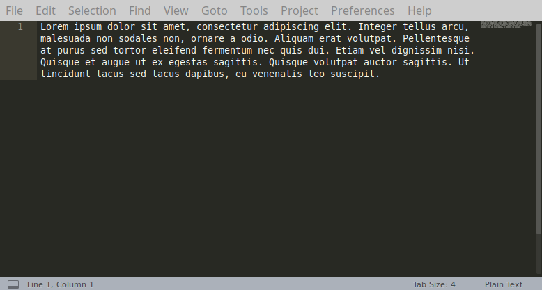
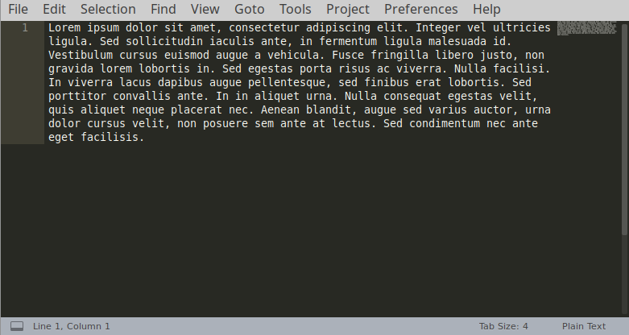
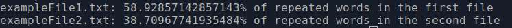
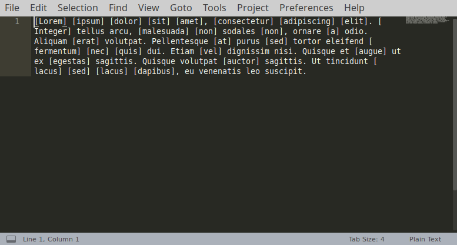
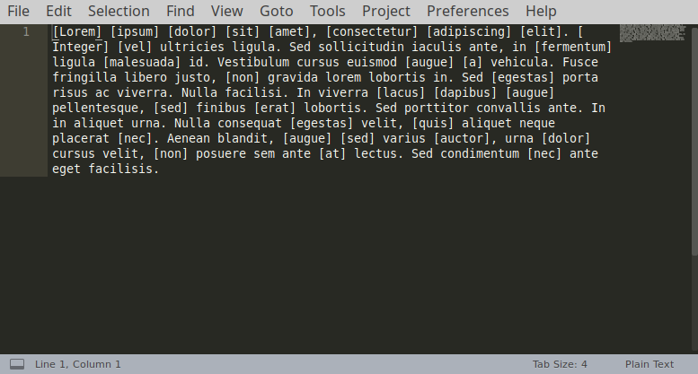

# repetitiveWords

Thanks to this program you will find out what percentage of two files consists of repetitive words in them. It will also create copies of these files, but with repetitive words marked (with "[ ]").

### Technologies
* Java 13

### Setup
To run this program, compile it with command
```sh
$ javac Main.java
```
Provide two input file names during startup, for example:
```sh
$ java Main exampleFile1.txt exampleFile2.txt
```

### Example of use

Input files:






Output:




Created files:






### Additional information
* Program creates two files: ```file1.txt``` and ```file2.txt```.
* Maximum size of file (maximum number of words in file) can be changed (variable ```maxlength```)
